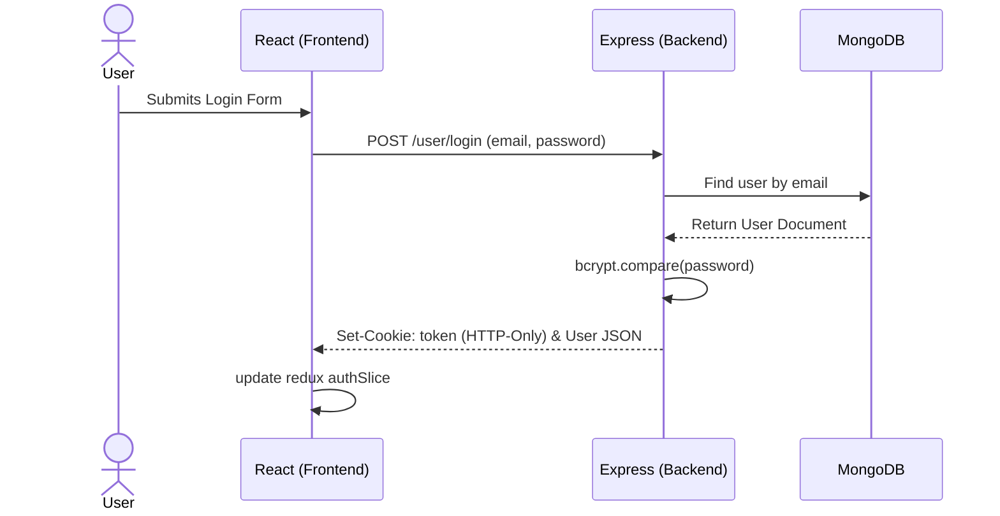
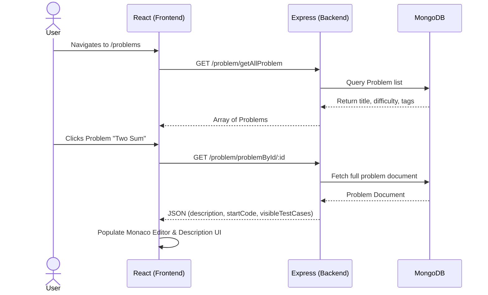
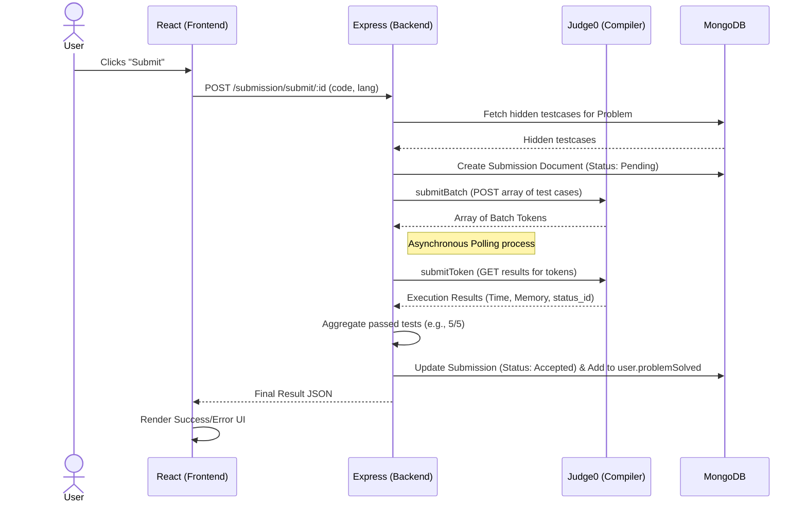
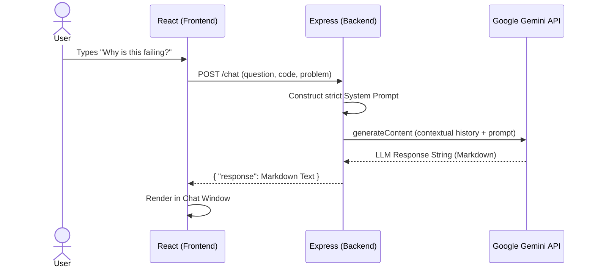

# CodeForge: System Workflows & API Data Contracts

This document provides a deep structural visualization of CodeForge's internal mechanics. It is designed to help developers and architects understand exact data movements, API contracts, and asynchronous integrations within the platform.

---

## 1. Major System Workflows & Diagrams

### 1.1 Authentication & Session Management Flow
**Process:** Users authenticate via email and password. CodeForge uses stateless JSON Web Tokens (JWT) stored securely in `HttpOnly` cookies. The frontend (`axiosClient`) automatically attaches these cookies via `withCredentials: true`. The Redux global state maintains the active user profile on the client.

### 1.2 Problem Fetching & UI Rendering Flow
**Process:** When navigating to the Homepage, the frontend initially fetches the catalog of problems. When clicking a specific problem, the frontend loads the full description, boilerplates, and visible test cases to populate the Monaco editor.

### 1.3 Code Execution Flow (Submit)
**Process:** When a user hits "Submit," their code is evaluated against hidden test cases. This is a multi-step integration with an external execution engine (e.g., Judge0) involving batch asynchronous execution and database persistence. (The "Run" workflow is identical but evaluates against *visible* test cases and skips DB persistence).

### 1.4 AI Coding Assistant Flow
**Process:** A highly contextual wrapper around Google Gemini. The system silently injects the user's specific problem text and real-time code into the AI prompt to act as an effective tutor.

---

## 2. API Data Contracts

### 2.1 Authentication Endpoints
**`POST /user/login`**
* **Purpose:** Authenticate user and issue JWT cookie.
* **Payload:** `{ "email": "user@test.com", "password": "secure123" }`
* **Response (200 OK):** 
  `{ "message": "Login successful", "user": { "_id": "...", "firstName": "John", "role": "user", "isPaid": false } }`
* **Headers/Cookies:** Sets `token` HTTP-Only cookie.

**`GET /user/check`**
* **Purpose:** Verify existing active session on page load mapping to `optionalAuthMiddleware`.
* **Payload:** None.
* **Response (200 OK):** 
  `{ "isAuthenticated": true, "user": { "firstName": "John", "_id": "...", "isPaid": false } }`

### 2.2 Problem Endpoints
**`GET /problem/getAllProblem`**
* **Purpose:** Fetch catalog for the problems list view.
* **Response (200 OK):** Array of Objects.
  `[ { "_id": "123", "title": "Two Sum", "difficulty": "easy", "tags": "array" } ]`

**`GET /problem/problemById/:id`**
* **Purpose:** Fetch detailed context for the active editor.
* **Response (200 OK):** 
  `{
    "_id": "123", "title": "Two Sum", "description": "...", 
    "visibleTestCases": [ { "input": "...", "output": "..." } ],
    "startCode": [ { "language": "javascript", "initialCode": "function(..." } ]
  }`

### 2.3 Execution Endpoints
**`POST /submission/submit/:id`** (Auth Required)
* **Purpose:** Execute code against hidden testcases and save progress to DB.
* **Payload:** `{ "code": "console.log('hi')", "language": "javascript" }`
* **Response (201 Created):** 
  `{
    "status": "accepted",
    "testCasesPassed": 5, "testCasesTotal": 5, 
    "runtime": 12.5, "memory": 4020,
    "errorMessage": null
  }`

### 2.4 Chat Endpoint
**`POST /chat`**
* **Purpose:** Converse with the Gemini-powered coding assistant.
* **Payload:** `{ "question": "What is wrong?", "code": "...", "language": "cpp", "problem": { "description": "..." } }`
* **Response (200 OK):** `{ "response": "You missed a semicolon on line 5..." }`

---

## 3. Data Models & Schemas

The primary database is MongoDB. Fields and relationships are shown below:

### `User` Collection
* **`_id`**: ObjectId
* **`firstName`, `lastName`**: String
* **`emailId`**: String (Unique)
* **`password`**: String (bcrypt hashed)
* **`role`**: String (`user` | `admin`)
* **`isPaid`**: Boolean (Controls access to Editorials & Solutions)
* **`problemSolved`**: `[ObjectId]` (References [Problem](file:///c:/projects/codeforge/CFFrontend/src/pages/ProblemPage.jsx#14-950) collection)

### [Problem](file:///c:/projects/codeforge/CFFrontend/src/pages/ProblemPage.jsx#14-950) Collection
* **`_id`**: ObjectId
* **`title`, `description`**: String
* **`difficulty`**: Enum (`easy`, `medium`, `hard`)
* **`tags`**: String (Enum of topics like `array`, `dp`)
* **`visibleTestCases`**: Array `{ input: String, output: String, explanation: String }`
* **`hiddenTestCases`**: Array `{ input: String, output: String }`
* **`startCode`**: Array `{ language: String, initialCode: String }`
* **`referenceSolution`**: Array `{ language: String, completeCode: String }` (Premium Only)

### `Submission` Collection
* **`_id`**: ObjectId
* **`userId`**: ObjectId (Ref to `User`)
* **`problemId`**: ObjectId (Ref to [Problem](file:///c:/projects/codeforge/CFFrontend/src/pages/ProblemPage.jsx#14-950))
* **`code`**: String (Raw user payload)
* **`language`**: String
* **`status`**: Enum (`accepted`, `pending`, `wrong`, `error`)
* **`runtime`**: Number (ms)
* **`memory`**: Number (KB)
* **`testCasesPassed`**: Number

**Schema Flow Notes:** Submissions track every attempt. If a Submission's resulting `status` evaluates to `accepted`, the Backend retrieves the parent `User` document and explicitly updates the `problemSolved` array by pushing the `problemId` (if it isn't already there).

---

## 4. Asynchronous Processes & Complexities

**The Execution Polling Mechanism:**
The most complex async behavior resides in [userSubmission.js](file:///c:/projects/codeforge/CodeForge/src/controllers/userSubmission.js). When submitting code, evaluating 10 hidden test cases is heavily intensive.
1. **Batch Target:** The server maps the payload and calls `submitBatch` pointing to a compilation engine.
2. **Immediate Reply:** The compiler responds immediately with an array of `tokens` (receipts), while putting the actual compilations in a background queue.
3. **Polling Aggregation:** The server then calls `submitToken(resultToken)` which awaits/polls the compiler engine until the jobs linked to those tokens are completed.
4. **Aggregate Results:** Once all tests finish, the Express server parses the array of execution objects, checks if any returned `status_id === 4` (Wrong Answer), calculates cumulative runtime, and determines the final monolithic `status` dispatched to the frontend.

## 5. How to Explain This in an Interview

*If asked about the system design or execution engine, use these concise explanation scripts:*

**Auth Flow:** "We use a stateless HTTP-Only cookie architecture. The Express server validates credentials, signs a JWT, and attaches it as a secure cookie. The React client intercepts this state into Redux, allowing protected route access without exposing tokens to XSS attacks."

**Code Execution Architecture:** "Code execution is completely decoupled from our primary API server for security. When a user submits code, the Node.js backend retrieves hidden test cases from MongoDB, constructs a batch job containing the code and test streams, and sends it to an isolated compiler API. Our backend then aggregates the test results, scores the submission, and persists the telemetry (time/memory) to the database."

**Contextual AI Chat Feature:** "Our AI assistant is a prompt-engineering wrapper around Google's Gemini Flash. When a user asks a question, the frontend sends the active editor's code and the problem text to a dedicated endpoint. The Node backend constructs a strict system prompt instructing the LLM to act as a Socratic tutor, returning specifically formatted feedback meant to guide rather than give away the exact answer."
